# API Oceanautas 

## Requerimientos:

Crear una API como solución tecnologica para incluir la tecnologia en los problemas de los oceanos.

## Propuesta:

Este repositorio es la implementacón de una API para llevar el control de reportes de contaminantes en los oceanos generados por organizaciones. Esto atraves de un modelo que contempla 3 tipos de usuario:

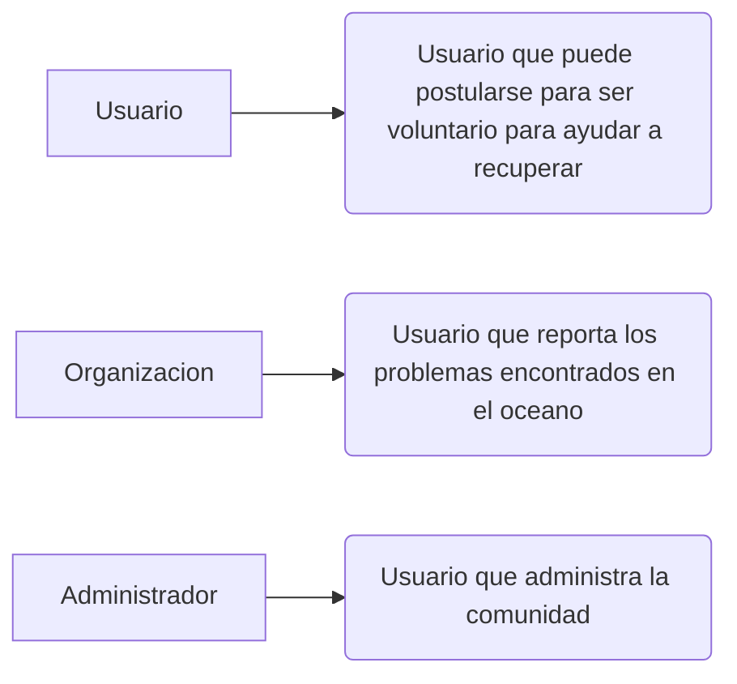
```mermaid
graph LR
    Usuario --> B(Usuario que puede postularse para ser voluntario para ayudar a recuperar)
    Organizacion --> C(Usuario que reporta los problemas encontrados en el oceano)
        Administrador --> D(Usuario que administra la comunidad)
``` 

Los usuarios interactuan de tal forma que un usuario puede crear algun reporte de contaminacion y este se almacenara en la DB, mientras que algun otro usuario puede apoyar para erradicar el problema realizando una donación o siendo voluntario. 

El diagrama entidad relacion del modelo entidad relacion propuesto que permita cumplir el requerimiento de interacción es el siguiente:

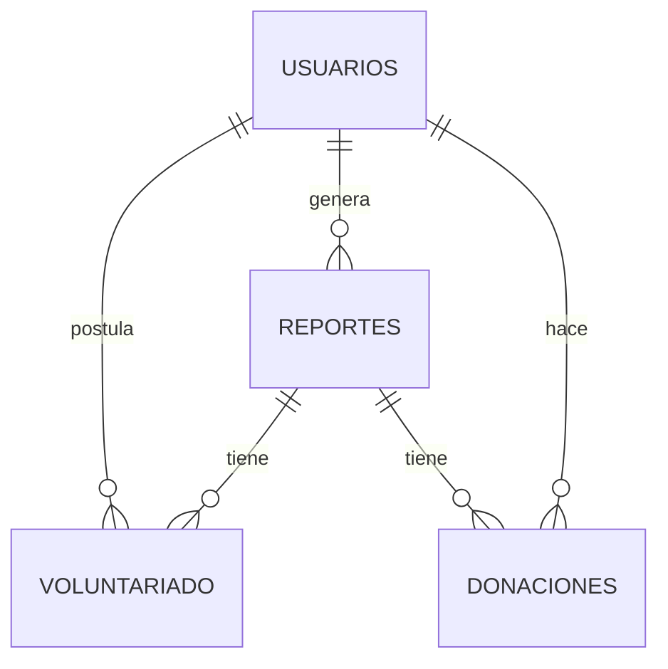
```mermaid
erDiagram
          REPORTES ||--o{ VOLUNTARIADO : tiene
          USUARIOS ||--o{ REPORTES : genera
          USUARIOS ||--o{ DONACIONES : hace
          USUARIOS ||--o{ VOLUNTARIADO : postula
          REPORTES ||--o{ DONACIONES : tiene
          
```

Mientras que el diagrama de la estructura de la API se muestra a continuación:

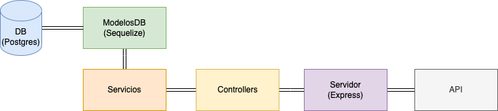  

# Estructura del proyecto

```
LaunchX_Hackaton
├─ .gitignore                   /*Archivos a ser ignorados por git*/
├─ Back-End
│  ├─ .eslintrc.js              /*Archivos a ser ignorados*/
│  ├─ README.md
│  ├─ docs
│  │  └─ LaunchXHackaton.postman_collection.json  /*Colección de peticiones POSTMAN*/
│  ├─ lib                                          
│  │  ├─ app.js                 /*Servidor Express que contiene los endpoints*/
│  │  ├─ models                 /*Modelos para la conexion de la base de datos*/
│  │  │  ├─ donation.js
│  │  │  ├─ report.js
│  │  │  ├─ roles.js
│  │  │  ├─ user.js
│  │  │  └─ volunteer.js
│  │  ├─ modelsService          /*Controladores para comunicarse el servidor con la DB*/
│  │  │  ├─ donation.js
│  │  │  ├─ report.js
│  │  │  ├─ user.js
│  │  │  └─ volunteer.js
│  │  ├─ relations.js           /*Servicios para comunicarse con la base de datos*/
│  │  ├─ setup.js               /*Script para instalar la base de datos*/
│  │  └─ utils
│  │     ├─ config.js           /*Credenciales de la base de datos*/
│  │     └─ db.js               /*Instancia de la base de datos*/
│  ├─ package-lock.json
│  ├─ package.json
│  └─ test                      /*Carpeta de pruebas*/
│     ├─ app.test.js            /*Pruebas de enpoints*/
│     ├─ lib
│     │  └─ controllers
│     │     └─ user.test.js     /*Pruebas los controladores para la api*/
│     └─ utils
│        └─ configTest.js
```


# Como utilizar

* Clonar el repositorio
* Ingresar en Back-End Folder
* Instalar las dependencias NPM con el comando **npm init**
* Para instalar la base de datos se debe crear un archivo llamado **.env** en la raiz de la carpeta de BACK-END con la siguiente estructura

```
DB=[Nombre de la base de datos]
USDB=[Nombre del usuario de base de datos]
PSDB=[Contraseña de la base de datos]
HTDB=[Host de la base de datos]
PORTDB=[Puerto de la base de datos]
STDB=true
SECRET=[contraseña para generar tokens de acceso]
```
* Correr el archivo setup dentro de la carpeta de lib con el comando **node lib/setup.js** que instará la base de datos

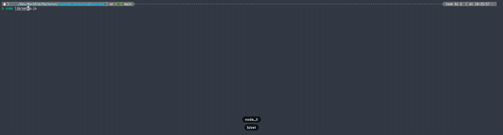  


* Una vez ejecutado el script de setup se puede iniciar el servidor express con el comando **npm run start** y se podra utilzar el servicio. En la parte inferior esta descrito con mas detalle el funcionamiento de los endpoints

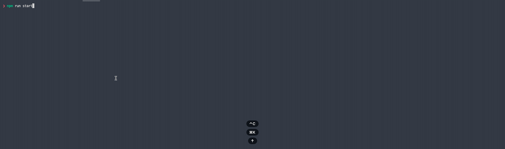  


# Pruebas

* Para ejecutar las pruebas se debe crear un archivo llamado **.env** en /test/ con la siguiente estructura

```
DB=[Nombre de la base de datos]
USDB=[Nombre del usuario de base de datos]
PSDB=[Contraseña de la base de datos]
HTDB=[Host de la base de datos]
PORTDB=[Puerto de la base de datos]
STDB=true
SECRET=[contraseña para generar tokens de acceso]
```

* La informacion puesta aqui sobreescribira la base de datos por lo que es recomendable probar con una base de datos de prueba.
* Para ejecutar las pruebas se ejecutará el comando **npm run test** que ejecutara un set de pruebas en jets


  


## Dependencias utilizadas
- **bcryptjs - V2.4.3**
- **dotenv - V16.0.1**
- **express - V4.18.1**
- **express -asyncify- V1.0.1**
- **jsonwebtoken - V8.5.1**
- **pg - V8.7.3**
- **pg-hstore- V2.3.4**
- **sequelize - V6.19.0**


## Dependencias de desarrollo utilizadas
- **eslint - V8.15.0**
- **jest - V28.1.0**
- **supertest - V6.2.**

## End-Points Implementados

Para probar los endpoints implementados es necesario reemplazar **{{url}}** por el host correspondiente o crear una variable de entorno en postman para poder ejecutar de forma correcta

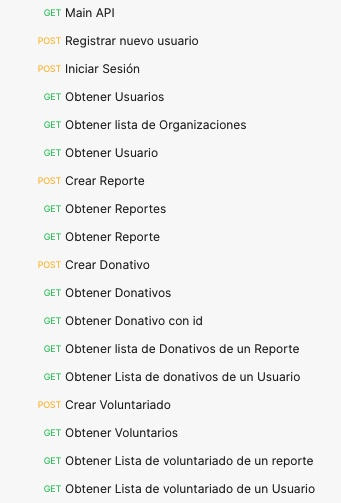  

[Descarga colección de Postman](./docs/LaunchXHackaton.postman_collection.json)  

## End-point: **Main API**

Endpoint para probar que el servicio funcionara de forma correcta

### Method: **GET**
>```
>/api/
>```

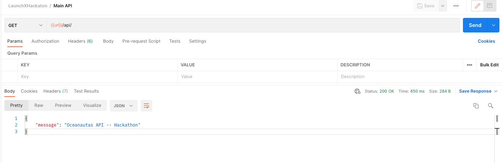  

⁃ ⁃ ⁃ ⁃ ⁃ ⁃ ⁃ ⁃ ⁃ ⁃ ⁃ ⁃ ⁃ ⁃ ⁃ ⁃ ⁃ ⁃ ⁃ ⁃ ⁃ ⁃ ⁃ ⁃ ⁃ ⁃ ⁃ ⁃ ⁃ ⁃ ⁃ ⁃ ⁃ ⁃ ⁃ ⁃ ⁃ ⁃ ⁃ ⁃ ⁃ ⁃ ⁃ ⁃ ⁃ ⁃ ⁃

## End-point: **Registrar nuevo usuario**

EndPoint para Registrar un nuevo usuario al servicio

### Method: **POST**
>```
>/api/register
>```
### Body (**raw**)

```json
{
    "name": "Oceanauta22",
    "username": "Oceanauta22",
    "email": "test22@oceanauta.com",
    "password": "prueba",
    "role": ["admin"]
}
```
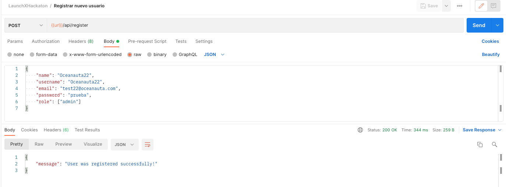  


⁃ ⁃ ⁃ ⁃ ⁃ ⁃ ⁃ ⁃ ⁃ ⁃ ⁃ ⁃ ⁃ ⁃ ⁃ ⁃ ⁃ ⁃ ⁃ ⁃ ⁃ ⁃ ⁃ ⁃ ⁃ ⁃ ⁃ ⁃ ⁃ ⁃ ⁃ ⁃ ⁃ ⁃ ⁃ ⁃ ⁃ ⁃ ⁃ ⁃ ⁃ ⁃ ⁃ ⁃ ⁃ ⁃ ⁃

## End-point: **Iniciar Sesión**
### Method: **POST**

EndPoint para iniciar sesion en el servicio

>```
>/api/login
>```
### Body (**raw**)

```json
{
    "email": "test22@oceanauta.com",
    "password": "prueba"
}
```

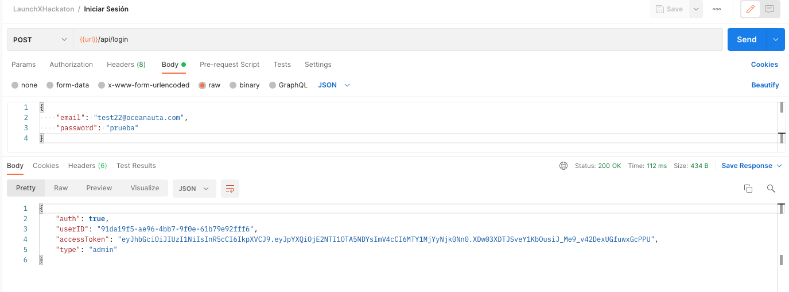  


⁃ ⁃ ⁃ ⁃ ⁃ ⁃ ⁃ ⁃ ⁃ ⁃ ⁃ ⁃ ⁃ ⁃ ⁃ ⁃ ⁃ ⁃ ⁃ ⁃ ⁃ ⁃ ⁃ ⁃ ⁃ ⁃ ⁃ ⁃ ⁃ ⁃ ⁃ ⁃ ⁃ ⁃ ⁃ ⁃ ⁃ ⁃ ⁃ ⁃ ⁃ ⁃ ⁃ ⁃ ⁃ ⁃ ⁃

## End-point: **Obtener Usuarios**
### Method: **GET**
EndPoint para obtener una lista de todos los usuarios registrados

>```
>/api/usuarios
>```

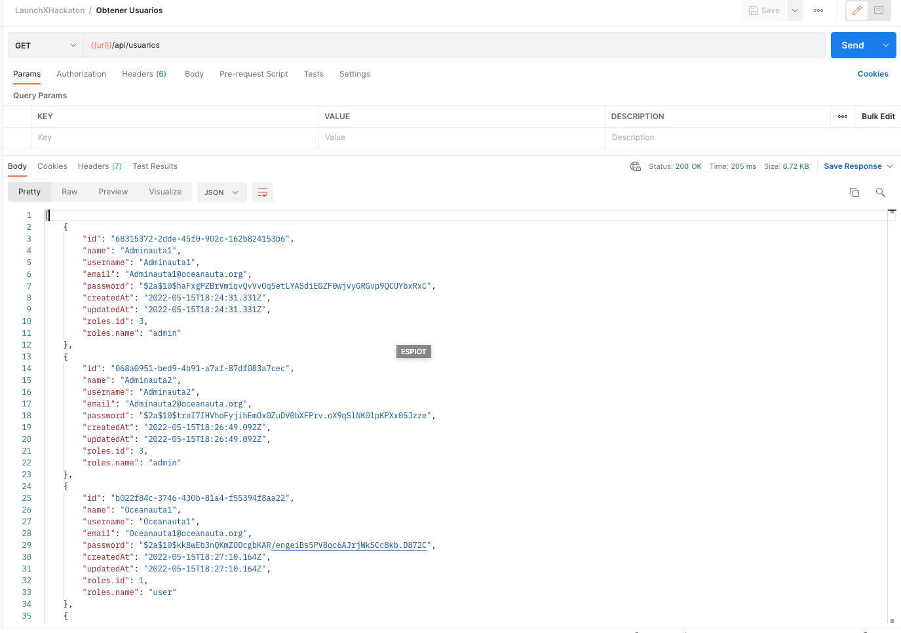  


⁃ ⁃ ⁃ ⁃ ⁃ ⁃ ⁃ ⁃ ⁃ ⁃ ⁃ ⁃ ⁃ ⁃ ⁃ ⁃ ⁃ ⁃ ⁃ ⁃ ⁃ ⁃ ⁃ ⁃ ⁃ ⁃ ⁃ ⁃ ⁃ ⁃ ⁃ ⁃ ⁃ ⁃ ⁃ ⁃ ⁃ ⁃ ⁃ ⁃ ⁃ ⁃ ⁃ ⁃ ⁃ ⁃ ⁃

## End-point: **Obtener lista de Organizaciones**
### Method: **GET**
EndPoint para obtener una lista de las organizaciones registradas
>```
>/api/organizaciones/
>```

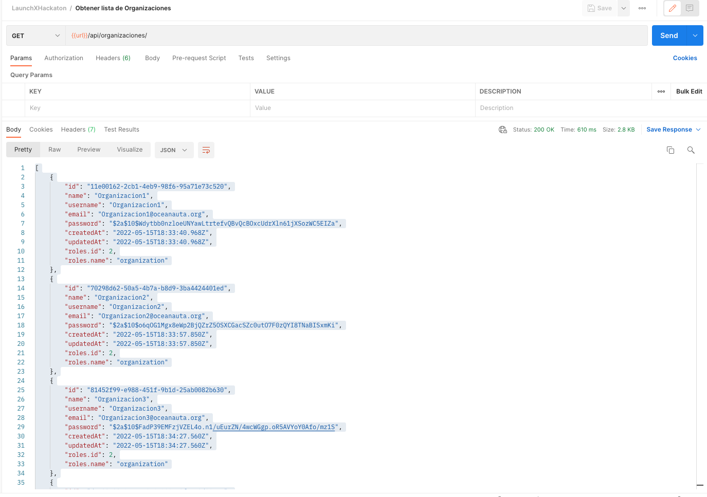  


⁃ ⁃ ⁃ ⁃ ⁃ ⁃ ⁃ ⁃ ⁃ ⁃ ⁃ ⁃ ⁃ ⁃ ⁃ ⁃ ⁃ ⁃ ⁃ ⁃ ⁃ ⁃ ⁃ ⁃ ⁃ ⁃ ⁃ ⁃ ⁃ ⁃ ⁃ ⁃ ⁃ ⁃ ⁃ ⁃ ⁃ ⁃ ⁃ ⁃ ⁃ ⁃ ⁃ ⁃ ⁃ ⁃ ⁃

## End-point: **Obtener Usuario**
### Method: **GET**
EndPoint para obtener la informacion de un usuario a partir de su ID asi como de las donaciones que ha realizado o si es voluntario en algun reporte
>```
>/api/usuarios/2beef41e-d2d5-42ce-bbc3-d6fc1c4a8932
>```

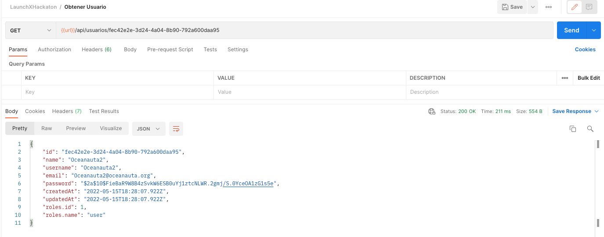  


⁃ ⁃ ⁃ ⁃ ⁃ ⁃ ⁃ ⁃ ⁃ ⁃ ⁃ ⁃ ⁃ ⁃ ⁃ ⁃ ⁃ ⁃ ⁃ ⁃ ⁃ ⁃ ⁃ ⁃ ⁃ ⁃ ⁃ ⁃ ⁃ ⁃ ⁃ ⁃ ⁃ ⁃ ⁃ ⁃ ⁃ ⁃ ⁃ ⁃ ⁃ ⁃ ⁃ ⁃ ⁃ ⁃ ⁃

## End-point: **Crear Reporte**
### Method: **POST**
EndPoint para crear un reporte con un nombre del problema, una descripción, la ubicación, el tipo de reporte que es y el usuario que crea el reporte. Permitiendo tener un control de quienes crean los reportes.
>```
>/api/reportes
>```
### Body (**raw**)

```json
{
   "name":"Derrame Pacifico",
   "description":"Lorem Ipsum is simply dummy text of the printing and typesetting industry. Lorem Ipsum has been the industry's standard dummy text ever since the 1500s, when an unknown printer took a galley of type and scrambled it to make a type specimen book. It has survived not only five centuries, but also the leap into electronic typesetting, remaining essentially unchanged. It was popularised in the 1960s with the release of Letraset sheets containing Lorem Ipsum passages, and more recently with desktop publishing software like Aldus PageMaker including versions of Lorem Ipsum.",
   "lat":"50.5",
   "lon":"50.5",
   "type":"Derrame",
   "userId":"91da19f5-ae96-4bb7-9f0e-61b79e92fff6"
}
```
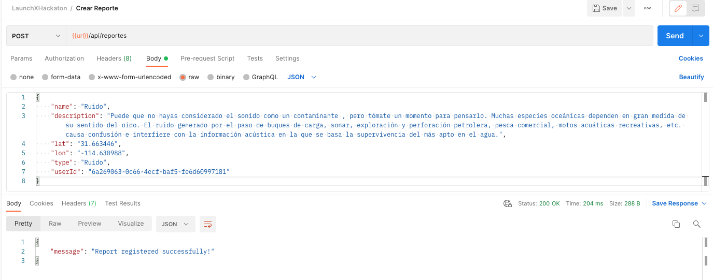  


⁃ ⁃ ⁃ ⁃ ⁃ ⁃ ⁃ ⁃ ⁃ ⁃ ⁃ ⁃ ⁃ ⁃ ⁃ ⁃ ⁃ ⁃ ⁃ ⁃ ⁃ ⁃ ⁃ ⁃ ⁃ ⁃ ⁃ ⁃ ⁃ ⁃ ⁃ ⁃ ⁃ ⁃ ⁃ ⁃ ⁃ ⁃ ⁃ ⁃ ⁃ ⁃ ⁃ ⁃ ⁃ ⁃ ⁃

## End-point: **Obtener Reportes**
### Method: **GET**
EndPoint para obtener todos los reportes registrados en el sistema
>```
>/api/reportes
>```

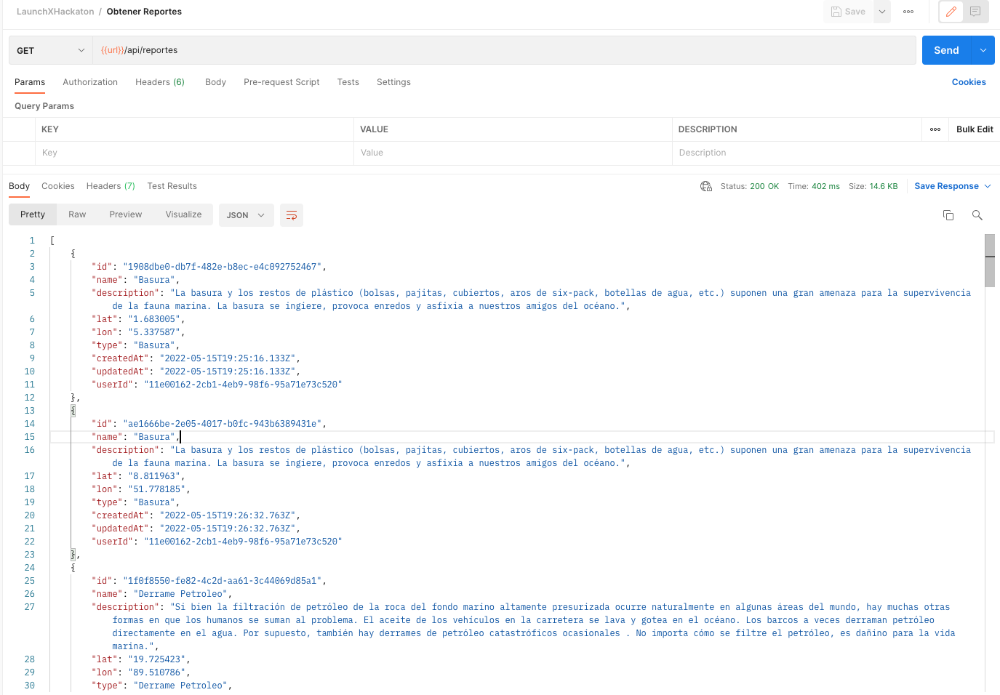  


⁃ ⁃ ⁃ ⁃ ⁃ ⁃ ⁃ ⁃ ⁃ ⁃ ⁃ ⁃ ⁃ ⁃ ⁃ ⁃ ⁃ ⁃ ⁃ ⁃ ⁃ ⁃ ⁃ ⁃ ⁃ ⁃ ⁃ ⁃ ⁃ ⁃ ⁃ ⁃ ⁃ ⁃ ⁃ ⁃ ⁃ ⁃ ⁃ ⁃ ⁃ ⁃ ⁃ ⁃ ⁃ ⁃ ⁃

## End-point: **Obtener Reporte**
### Method: **GET**
EndPoint para obtener un reporte a partir de su ID
>```
>/api/reportes/8fa50cd4-1784-407f-a1ed-d2b52232a936
>```
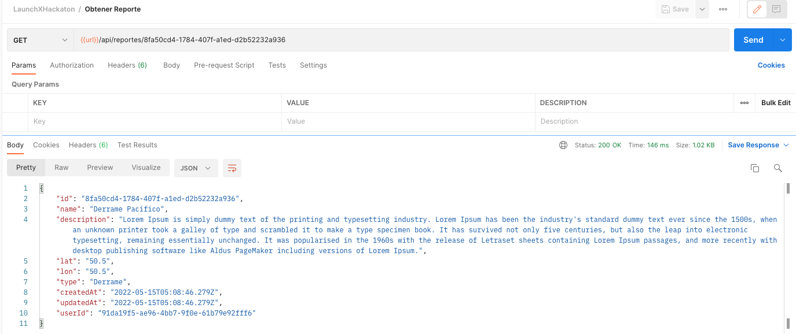  


⁃ ⁃ ⁃ ⁃ ⁃ ⁃ ⁃ ⁃ ⁃ ⁃ ⁃ ⁃ ⁃ ⁃ ⁃ ⁃ ⁃ ⁃ ⁃ ⁃ ⁃ ⁃ ⁃ ⁃ ⁃ ⁃ ⁃ ⁃ ⁃ ⁃ ⁃ ⁃ ⁃ ⁃ ⁃ ⁃ ⁃ ⁃ ⁃ ⁃ ⁃ ⁃ ⁃ ⁃ ⁃ ⁃ ⁃

## End-point: **Crear Donativo**
### Method: **POST**
EndPoint para que un usuario pueda crear una nueva donacion a algun reporte.
>```
>/api/donaciones
>```
### Body (**raw**)

```json
{
   "quantity":500,
   "reportId":"8fa50cd4-1784-407f-a1ed-d2b52232a936",
   "userId":"91da19f5-ae96-4bb7-9f0e-61b79e92fff6"
}
```

  


⁃ ⁃ ⁃ ⁃ ⁃ ⁃ ⁃ ⁃ ⁃ ⁃ ⁃ ⁃ ⁃ ⁃ ⁃ ⁃ ⁃ ⁃ ⁃ ⁃ ⁃ ⁃ ⁃ ⁃ ⁃ ⁃ ⁃ ⁃ ⁃ ⁃ ⁃ ⁃ ⁃ ⁃ ⁃ ⁃ ⁃ ⁃ ⁃ ⁃ ⁃ ⁃ ⁃ ⁃ ⁃ ⁃ ⁃

## End-point: **Obtener Donativos**
### Method: **GET**
EndPoint para obtener todos los donativos registrados en el sistema
>```
>/api/donaciones
>```
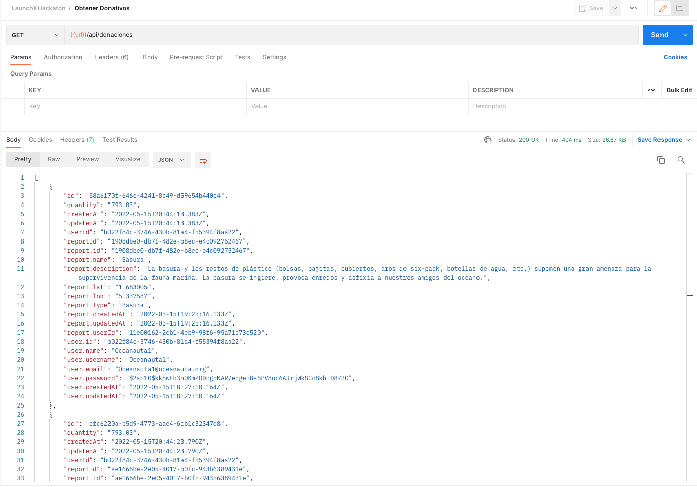  


⁃ ⁃ ⁃ ⁃ ⁃ ⁃ ⁃ ⁃ ⁃ ⁃ ⁃ ⁃ ⁃ ⁃ ⁃ ⁃ ⁃ ⁃ ⁃ ⁃ ⁃ ⁃ ⁃ ⁃ ⁃ ⁃ ⁃ ⁃ ⁃ ⁃ ⁃ ⁃ ⁃ ⁃ ⁃ ⁃ ⁃ ⁃ ⁃ ⁃ ⁃ ⁃ ⁃ ⁃ ⁃ ⁃ ⁃

## End-point: **Obtener Donativo con id**
### Method: **GET**
EndPoint para obtener la informacion de un donativo especifico a partir de su id
>```
>/api/donaciones/e8533c89-913e-4b98-908c-7b58092d93f0
>```

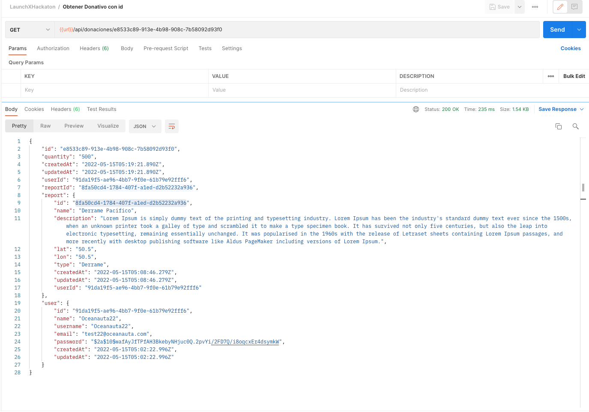  


⁃ ⁃ ⁃ ⁃ ⁃ ⁃ ⁃ ⁃ ⁃ ⁃ ⁃ ⁃ ⁃ ⁃ ⁃ ⁃ ⁃ ⁃ ⁃ ⁃ ⁃ ⁃ ⁃ ⁃ ⁃ ⁃ ⁃ ⁃ ⁃ ⁃ ⁃ ⁃ ⁃ ⁃ ⁃ ⁃ ⁃ ⁃ ⁃ ⁃ ⁃ ⁃ ⁃ ⁃ ⁃ ⁃ ⁃

## End-point: **Obtener lista de Donativos de un Reporte**
### Method: **GET**
Enpoint para obtener todos los donativos realizado a un reporte por medio de su id
>```
>/api/donaciones/reporte/2024d3a2-5863-4427-bd67-5afde347b3ee
>```
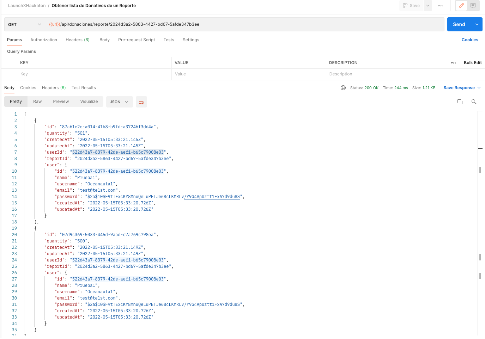  


⁃ ⁃ ⁃ ⁃ ⁃ ⁃ ⁃ ⁃ ⁃ ⁃ ⁃ ⁃ ⁃ ⁃ ⁃ ⁃ ⁃ ⁃ ⁃ ⁃ ⁃ ⁃ ⁃ ⁃ ⁃ ⁃ ⁃ ⁃ ⁃ ⁃ ⁃ ⁃ ⁃ ⁃ ⁃ ⁃ ⁃ ⁃ ⁃ ⁃ ⁃ ⁃ ⁃ ⁃ ⁃ ⁃ ⁃

## End-point: **Obtener Lista de donativos de un Usuario**
### Method: **GET**
EndPoint para obtener todos los donativos realizados por un usuario
>```
>/api/usuarios/donaciones/522d43a7-8379-42de-aef1-b65c79008e03
>```
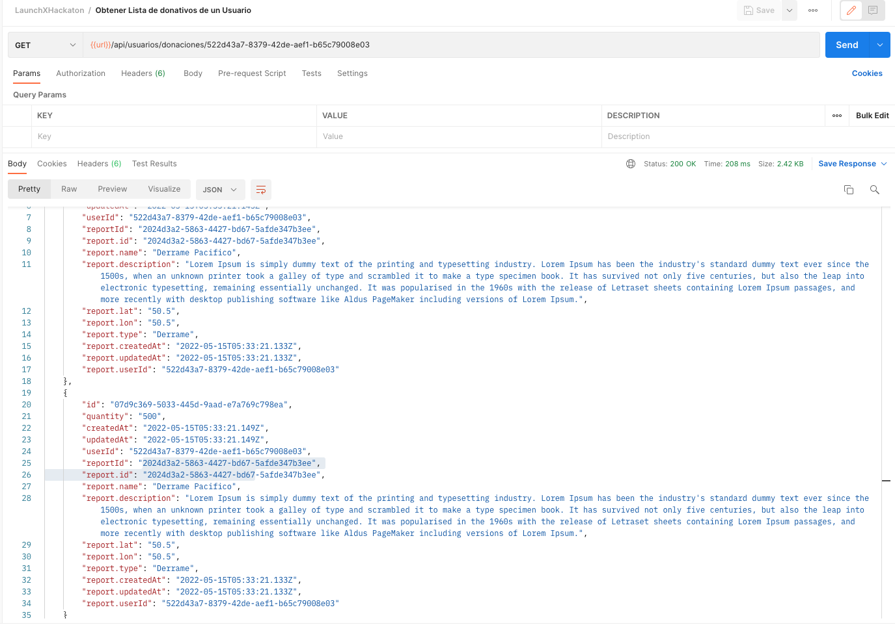  


⁃ ⁃ ⁃ ⁃ ⁃ ⁃ ⁃ ⁃ ⁃ ⁃ ⁃ ⁃ ⁃ ⁃ ⁃ ⁃ ⁃ ⁃ ⁃ ⁃ ⁃ ⁃ ⁃ ⁃ ⁃ ⁃ ⁃ ⁃ ⁃ ⁃ ⁃ ⁃ ⁃ ⁃ ⁃ ⁃ ⁃ ⁃ ⁃ ⁃ ⁃ ⁃ ⁃ ⁃ ⁃ ⁃ ⁃

## End-point: **Crear Voluntariado**
### Method: **POST**
EndPoint para registrarse como voluntario a algun reporte
>```
>/api/voluntarios
>```
### Body (**raw**)

```json
{
   "userId":"b47383b9-b456-432f-b714-5bb7ce0e040e",
   "reportId":"d5152bd3-cf3a-4b0d-86da-1b5f80e9800b"
}
```
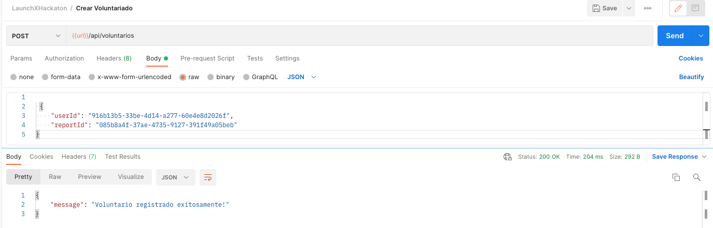  


⁃ ⁃ ⁃ ⁃ ⁃ ⁃ ⁃ ⁃ ⁃ ⁃ ⁃ ⁃ ⁃ ⁃ ⁃ ⁃ ⁃ ⁃ ⁃ ⁃ ⁃ ⁃ ⁃ ⁃ ⁃ ⁃ ⁃ ⁃ ⁃ ⁃ ⁃ ⁃ ⁃ ⁃ ⁃ ⁃ ⁃ ⁃ ⁃ ⁃ ⁃ ⁃ ⁃ ⁃ ⁃ ⁃ ⁃

## End-point: **Obtener Voluntarios**
### Method: **GET**
EndPoint para obtener todos los voluntarios regresando a que reporte corresponden y el usuario correspondiente
>```
>/api/voluntarios
>```
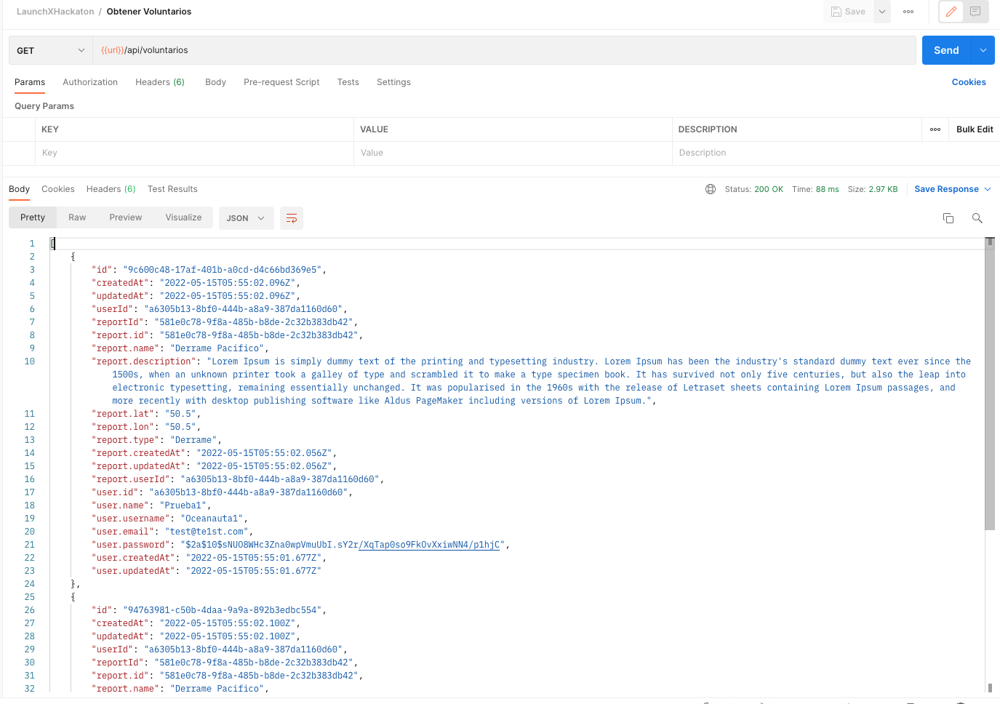  


⁃ ⁃ ⁃ ⁃ ⁃ ⁃ ⁃ ⁃ ⁃ ⁃ ⁃ ⁃ ⁃ ⁃ ⁃ ⁃ ⁃ ⁃ ⁃ ⁃ ⁃ ⁃ ⁃ ⁃ ⁃ ⁃ ⁃ ⁃ ⁃ ⁃ ⁃ ⁃ ⁃ ⁃ ⁃ ⁃ ⁃ ⁃ ⁃ ⁃ ⁃ ⁃ ⁃ ⁃ ⁃ ⁃ ⁃

## End-point: **Obtener Lista de voluntariado de un reporte**
### Method: **GET**
EndPoint para obtener todos los voluntarios de un reporte en especifico
>```
>/api/usuarios/voluntario/a6305b13-8bf0-444b-a8a9-387da1160d60
>```

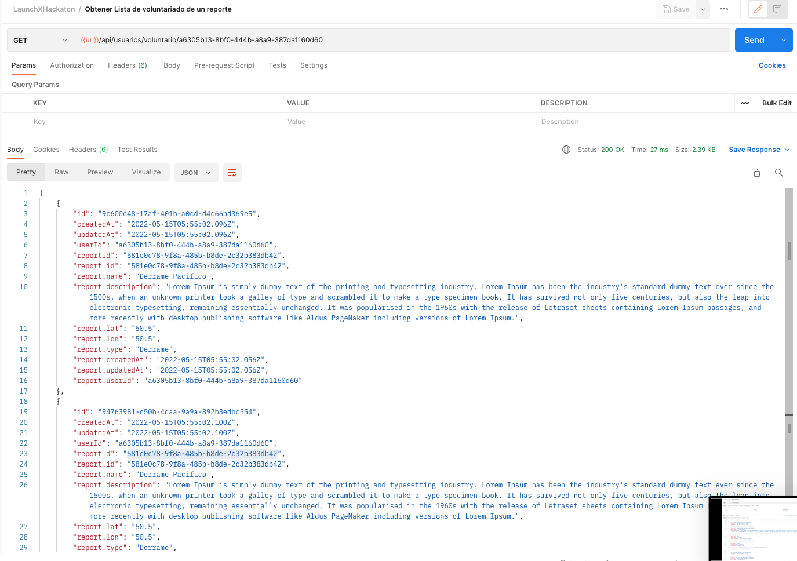  

⁃ ⁃ ⁃ ⁃ ⁃ ⁃ ⁃ ⁃ ⁃ ⁃ ⁃ ⁃ ⁃ ⁃ ⁃ ⁃ ⁃ ⁃ ⁃ ⁃ ⁃ ⁃ ⁃ ⁃ ⁃ ⁃ ⁃ ⁃ ⁃ ⁃ ⁃ ⁃ ⁃ ⁃ ⁃ ⁃ ⁃ ⁃ ⁃ ⁃ ⁃ ⁃ ⁃ ⁃ ⁃ ⁃ ⁃

## End-point: **Obtener Lista de voluntariado de un Usuario**
### Method: **GET**
EndPoint para obtener la lista de los reportes a los que un usuario esta registrado como voluntario
>```
>/api/usuarios/voluntarios/581e0c78-9f8a-485b-b8de-2c32b383db42
>```
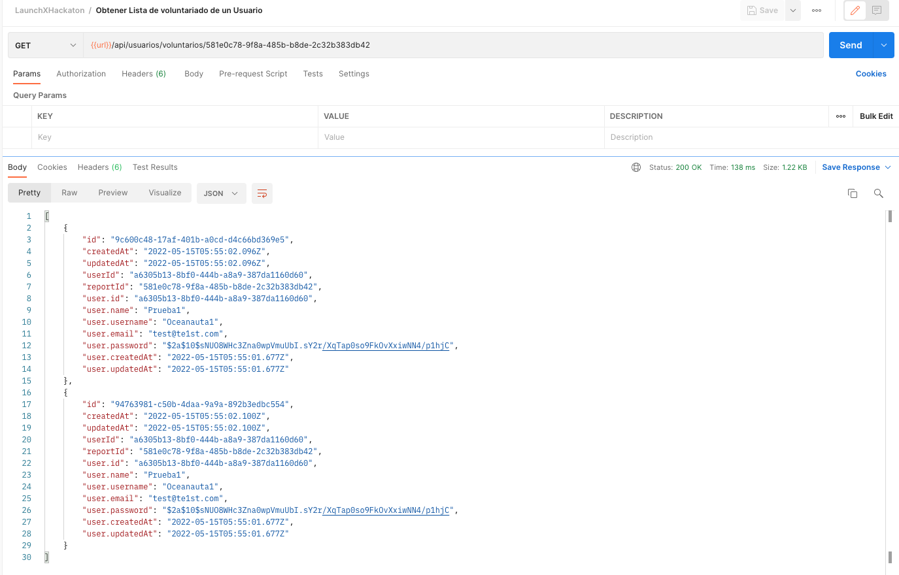  


⁃ ⁃ ⁃ ⁃ ⁃ ⁃ ⁃ ⁃ ⁃ ⁃ ⁃ ⁃ ⁃ ⁃ ⁃ ⁃ ⁃ ⁃ ⁃ ⁃ ⁃ ⁃ ⁃ ⁃ ⁃ ⁃ ⁃ ⁃ ⁃ ⁃ ⁃ ⁃ ⁃ ⁃ ⁃ ⁃ ⁃ ⁃ ⁃ ⁃ ⁃ ⁃ ⁃ ⁃ ⁃ ⁃ ⁃
_________________________________________________


# Funciones por implementar y escalar
* Autenticación de las rutas
* Creación de enpoints para analizis de la información
* Servidor de sockets para enviar los reportes en tiempo real asi como las cantidades donadas y de voluntarios de cada reporte