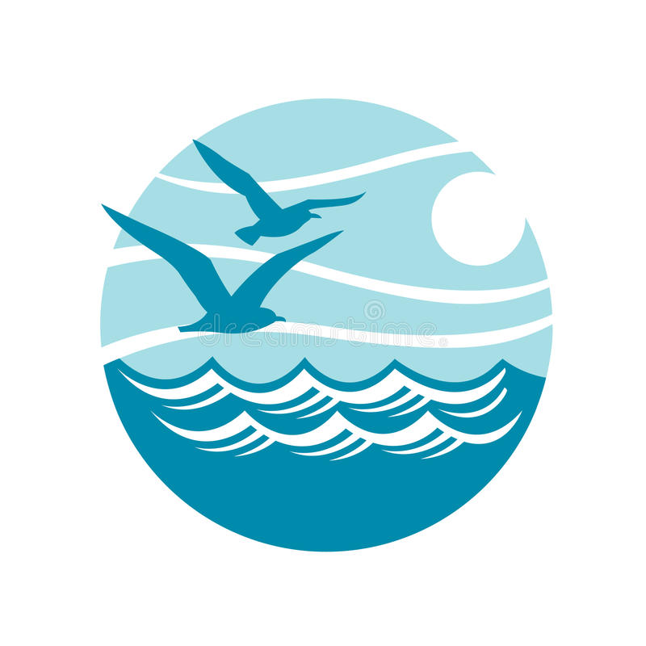

# LaunchX_Hackaton

Este repo contiene una solución tecnologica para mantener conectados a las organizaciones de forma directa con todas aquellas personas que deseen apoyar directa o indirectamente.

[Te invitamos a conocernos!!](https://www.tiktok.com/@danielanajul/video/7098127649075219718?_t=8SLVCC5IhN8&_r=1)

## Back End

- [Repo BackEnd](./Back-End/)
- [L̵i̵n̵k̵ ̵d̵e̵ ̵d̵e̵s̵p̵l̵i̵e̵g̵u̵e̵](https://oceanautas.org/api/)

## Front End

- [Repo FrontEnd](./Front-End/)
- [L̵i̵n̵k̵ ̵d̵e̵ ̵d̵e̵s̵p̵l̵i̵e̵g̵u̵e̵](https://oceanautas.org/)

## Problema:

Contaminación de los oceanos

## Desglose:

El problema que presentamos es al problema de la contaminación en los océanos la cual viene desde derrames petroleros, así como de la basura en las playas que es arrastrada por la marea.
Existen organizaciones que se encargan de combatir estas situaciones y preservar los océanos ya que son muy importantes para el mundo. Además de que muchas veces no somos conscientes de cuanto daño se les causa a nuestros océanos y si no vemos el daño es como si no existiera.

## Solución:

La solución que proponemos es que las personas puedan ser conscientes de cuanto se están dañando nuestros océanos alrededor del mundo además de concientizarlos ayudar a que se adentren en ayudar a solucionarlo apoyando a organizaciones que luchan contra estos problemas y juntos tratar de solucionar el problema de la contaminación en los océanos

Con esto en mente decidimos crear una aplicación web que es la siguiente

Nos permite ver los incidentes sobre la contaminación de los océanos alrededor del mundo y además de poder observar cual es el problema, podemos ver la organización que esta luchando contra ese problema, tenemos dos formas de ayudar, una es mediante un donativo monetario a la organización o la otra si se encuentra disponible es mediante voluntariado.
Podemos crear una cuenta y como usuario tener un dashboard con información más detallada sobre el incidente además de un newsletter para estar al tanto.

### Administración

La plataforma cuenta además con un dashboard para administrarla la cual podemos ver las estadísticas de las organizaciones, los usuarios y los tipos de apoyo que dan a las organizaciones, además de poder crear o eliminar organizaciones, así como eventos y mandar nuestra newsletter

